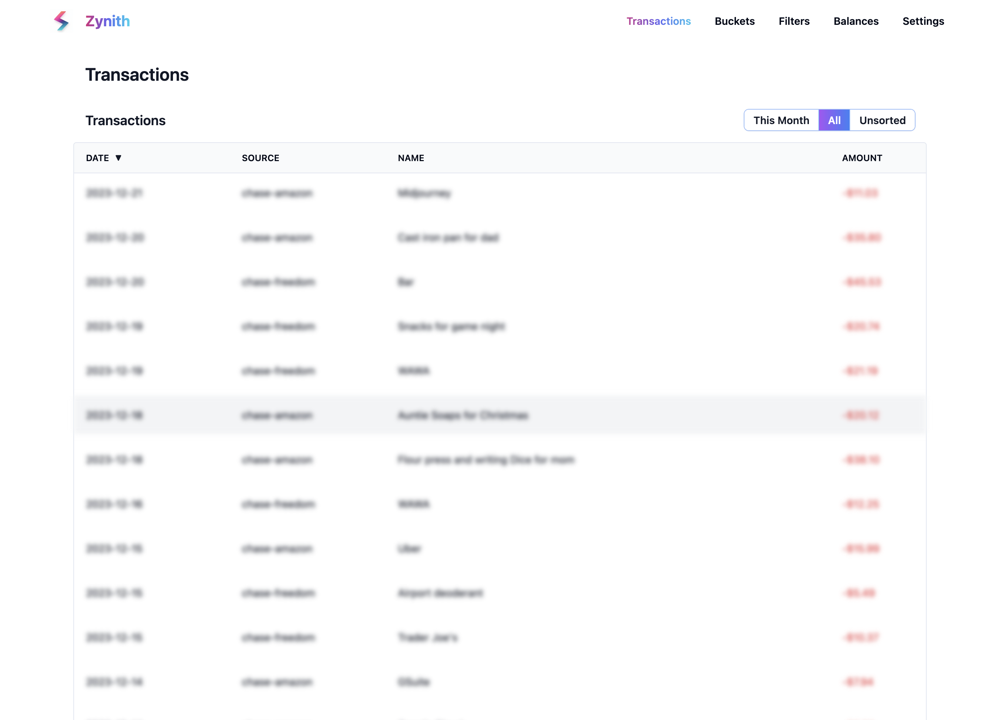
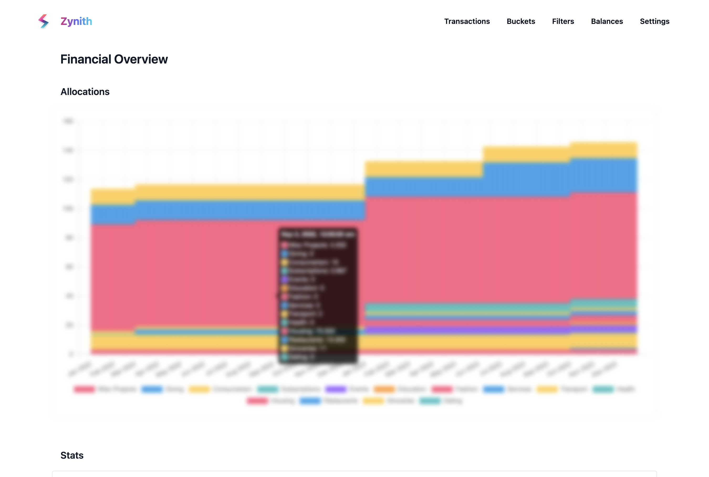
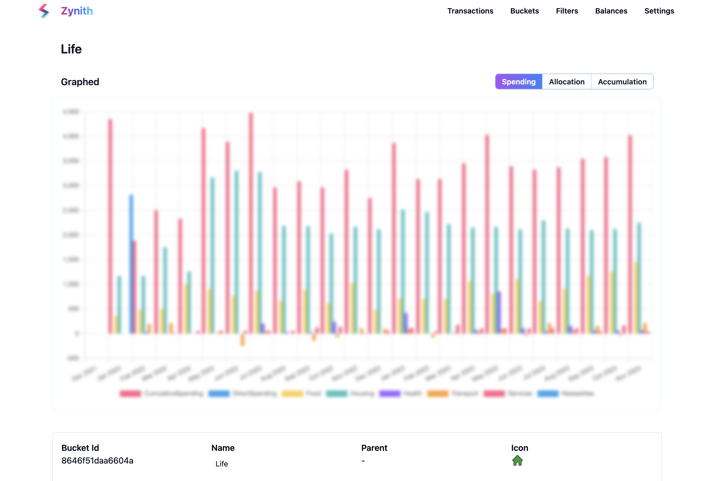
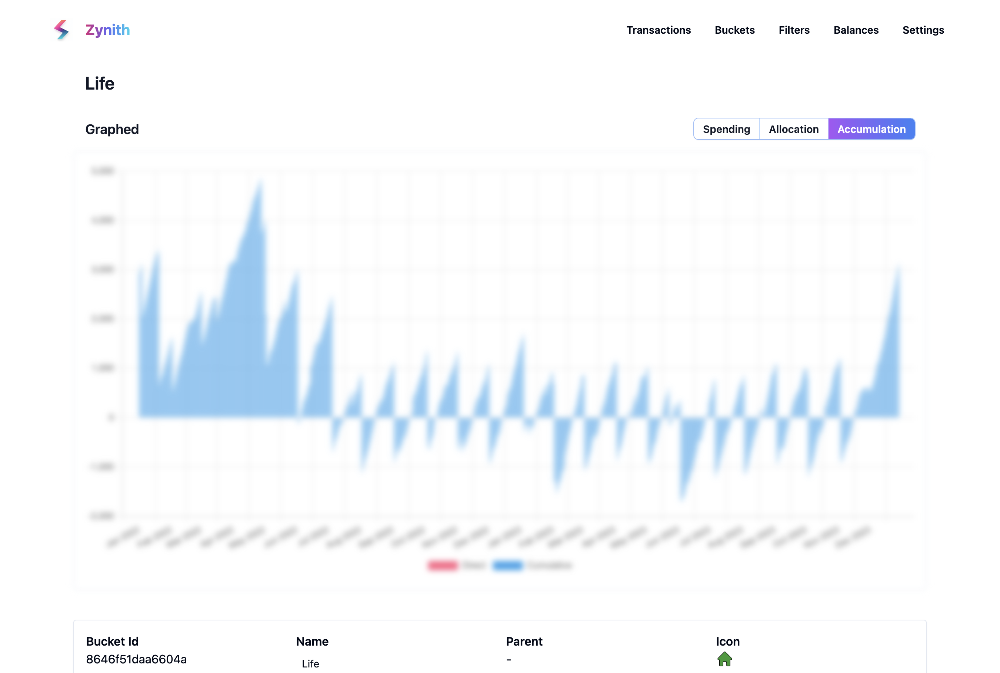

# Zynith

Zynith is a fully open-source local web application that provides a simple and intuitive api and interface for managing your budget.

Easily import any transactions you want into the local sqlite database through the nodejs api, and view them in the web interface.


Additional dashboard views allow you to view your spending habits over time, and track your savings and debt.


## Getting Started

Install the npm package
```bash
npm install zynith
```

Build the database and connect through the api
```javascript

// Import the client
import { Zynith  } from "zynith";

// Connect to a local sqlite database
const zynith = new Zynith({
    sqlite_filename: __dirname + "/zynith.sqlite",
});

// If the database does not exist, build it and configure all the tables
zynith.database.build()
```

Boot the web interface with simple npm scripts. Below is an example of how to boot the web interface with a package.json file. This will host through VITE and open both a local websocket server for sqlite and a react web interface to it.

```json
{
  "scripts": {
    "start": "npm explore zynith -- npm start"
  },
  "dependencies": {
    "zynith": "^1.0.0"
  }
}
```

Then import any data you need into the sqlite database through the simple api.

```javascript

// Bank / financial integration is up to you, but here is an example of a simple
for (const transaction of loadFromMyBank()) {

    await zynith.api.transactions.createTransaction({

        // The date of the transaction, any format that can be parsed by js
        date: '2020-01-01',

        // The description of the transaction from statement
        description: 'AMZN Order #1234',

        // The amount is in cents, positive for income, negative for expenses
        total: 100,

        // The sourceRef is a unique identifier for the source of the transaction
        sourceRef: 'my-credit-card-1'

    });
}

```

This transaction is now immediately available in the web interface! Simple an easy.


# Interfaces and Philosophy

Zynith comes with a collection of pre-devined constructs to help you manage your budget. These are all defined in the `./src/database/schema` folder. Lets explore them now and see what each can do.

## Transaction

Transactions represent a single line item on any financial statemnt you wish to use (bank, credit card, venmo, etc). They are the most basic building block of the system, and are used to build all other constructs.

They have the following properties:

- `id` - The unique identifier for the transaction, given by zynith via hashing the transaction data to prevent duplicates
- `date` - The date of the transaction, any format that can be parsed by js
- `description` - The raw description of the transaction from bank or provider

- `label` - The label of the transaction, optionally written by the user or updated by web interface

- `total` - The total amount of the transaction in cents, positive for income, negative for expenses

- `sourceRef` - The sourceRef is a unique identifier for the source of the transaction, such as a bank account or credit card

- `bucketRef` - The bucketRef is a unique identifier for the bucket the transaction is assigned to, if any

- `filterRef` - The filterRef is a unique identifier for the filter the transaction is assigned to, if any

## Bucket

Buckets are the next building block of the system. They are used to group transactions together into a single category. They have the following properties:

- `id` - The unique identifier for the bucket, given by zynith via hashing the bucket data to prevent duplicates

- `icon` - The icon of the bucket, optionally set by the user or updated by web interface

- `name` - The name of the bucket, optionally set by the user or updated by web interface

- `parent` - The parent of the bucket, if any

Buckets allow you to collect your transactions into categories, and then view your spending habits over time. They are the core of the system. Buckets can be nested to any depth, and can be used to represent sub categories of spending. 

Buckets provide a few peices of info when viewed in the web interface:

- Total amount of transactions directly placed in this bucket 

- The total sum of income and expenses of all transactions in this bucket in each month



- The total running balance of all transactions in this bucket over time. This is useful for tracking savings and debt. A bucket "accumulates" money when positive, and "depletes" money when negative. You can automatically allocate money to a bucket through the allocations system as to budget your money over time.



## Filter

Filters allow you to automatically assign transactions to buckets based on a set of rules. They have the following properties:

- `id` - The unique identifier for the filter, given by zynith via hashing the filter data to prevent duplicates

- `label` - The label that will automatically be assigned to transactions that match this filter

- `bucket` - The bucket that will automatically be assigned to transactions that match this filter

- `filter` - The filter string that will be looked for in the description of transactions to match this filter, if matched the label and bucket will be assigned to the transaction

## Allocation

Allocation allow you to automatically assign money to buckets based on a set of rules. They have the following properties:

- `id` - The unique identifier for the allocation, given by zynith via hashing the allocation data to prevent duplicates

- `targetBucket` - The bucket that will automatically be assigned to transactions that match this allocation

- `amount` - The amount of money that will be automatically assigned to the targetBucket every day for the duration of the allocation

- `startDate` - The date that the allocation will start

- `endDate` - The date that the allocation will end, or null and will run till present date

## Balance

Balance is a simple construct that represents the total amount of 'money' in a specific source at a given time. This helps track values like "what is my current net worth" or "how much money do I have in my checking account". They have the following properties:

- `id` - The unique identifier for the balance, given by zynith via hashing the balance data to prevent duplicates

- `source` - The sourceRef of the balance, such as a bank account or credit card

- `date` - The date of the balance, any format that can be parsed by js

- `balance` - The total amount of money in the source at the given date in cents
